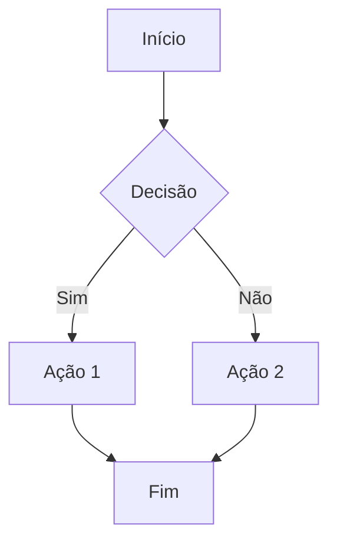

# 📝 TEMPLATE DE CURSO

Use este template para criar novos cursos no Núcleo Tático.

---

## 📋 METADADOS

```yaml
codigo: NT-XXX-XXX
nome: Nome Completo do Curso
categoria: [FUNDAMENTOS|CORE|TACTICAL|ESCOLAS|ESPORTES|OUTDOOR|INDUSTRIAL|EVENTOS|EMERGENCIA|ESPECIALIZADOS]
horas: 00
preco: R$ 000
status: [PLANEJADO|EM_PRODUCAO|REVISAO|PUBLICADO|ATUALIZACAO]
publico_alvo: [PM|Bombeiros|Civil|Escolas|Empresas|Geral]
prerequisitos: [NT-XXX-XXX|Nenhum]
instrutor: Nome do Instrutor
revisao_abnt: true
```

---

## 📚 ESTRUTURA DO CURSO

### Módulo 1: Introdução (XX%)
- [ ] Contextualização histórica
- [ ] Legislação aplicável
- [ ] Conceitos fundamentais
- [ ] Quiz de fixação (5 questões)

### Módulo 2: Fundamentos Teóricos (XX%)
- [ ] Teoria principal
- [ ] Evidências científicas (≥3 referências)
- [ ] Guidelines internacionais
- [ ] Caso clínico/operacional

### Módulo 3: Técnica/Procedimento (XX%)
- [ ] Passo a passo detalhado
- [ ] Imagens/diagramas (≥3)
- [ ] Vídeo demonstrativo (opcional)
- [ ] Checklist de verificação

### Módulo 4: Cenários Práticos (XX%)
- [ ] Simulação 1: [descrição]
- [ ] Simulação 2: [descrição]
- [ ] Simulação 3: [descrição]
- [ ] Debriefing/discussão

### Módulo 5: Avaliação e Certificação (XX%)
- [ ] Prova teórica (20-30 questões)
- [ ] Prática demonstrativa
- [ ] Critérios de aprovação
- [ ] Certificado digital

---

## 🎨 ELEMENTOS VISUAIS

### Boxes Especiais
```
📦 CAIXA DE CONHECIMENTO
Fato ou conceito importante para memorização.

⚠️ CAIXA DE ATENÇÃO
Risco, cuidado ou contraindicação.

💡 CAIXA DE INSIGHT
Dica prática do instrutor.

🩺 CAIXA CLÍNICA
Caso real ou simulado para análise.

📜 CAIXA LEGAL
Fundamento legal ou normativo.
```

### Tabelas
Use tabelas para:
- Comparações (vantagens/desvantagens)
- Checklists
- Dosagens/protocolos
- Cronogramas

### Fluxogramas
Use Mermaid para fluxogramas:


---

## 📖 REFERÊNCIAS

### Padrão ABNT NBR 6023:2018

**Livro:**
SOBRENOME, N. Nome do Livro. Edição. Cidade: Editora, Ano.

**Artigo:**
SOBRENOME, N. Título do artigo. *Nome da Revista*, v. XX, n. XX, p. XX-XX, Ano.

**Site:**
NOME DO SITE. Título da página. Disponível em: <URL>. Acesso em: DD MMM. AAAA.

**Guideline:**
ORGANIZAÇÃO. Título do guideline. Cidade/Estado: Editora, Ano.

---

## 🧪 CHECKLIST DE QUALIDADE

- [ ] Conteúdo técnico revisado por especialista
- [ ] Referências ABNT formatadas (NBR 6023:2018)
- [ ] Citações no texto (NBR 10520:2023)
- [ ] Imagens com direitos autorais OK (open source / CC / própria)
- [ ] Quiz com respostas e justificativas
- [ ] Prova com gabarito comentado
- [ ] POPS escrito e revisado
- [ ] Disclaimer legal incluso
- [ ] Teste de leitura (Flesch > 50 para PT-BR)
- [ ] Validação IA (faithfulness ≥ 0.8)

---

## 📦 PACOTE DE ENTREGA

```
NT-XXX-XXX_PACOTE_COMPLETO.zip
├── CURSO_COMPLETO_NT-XXX-XXX.md
├── SLIDES_NT-XXX-XXX.md
├── PROVA_NT-XXX-XXX.md
├── GABARITO_NT-XXX-XXX.md
├── POPS-NT-XXX-XXX.md
├── REFERENCIAS_NT-XXX-XXX.md
├── IMAGENS/
│   ├── 01_*.png
│   ├── 02_*.png
│   └── ...
└── CERTIFICADO/
    └── modelo_certificado.html
```

---

*Template v1.0 — Núcleo Tático*
